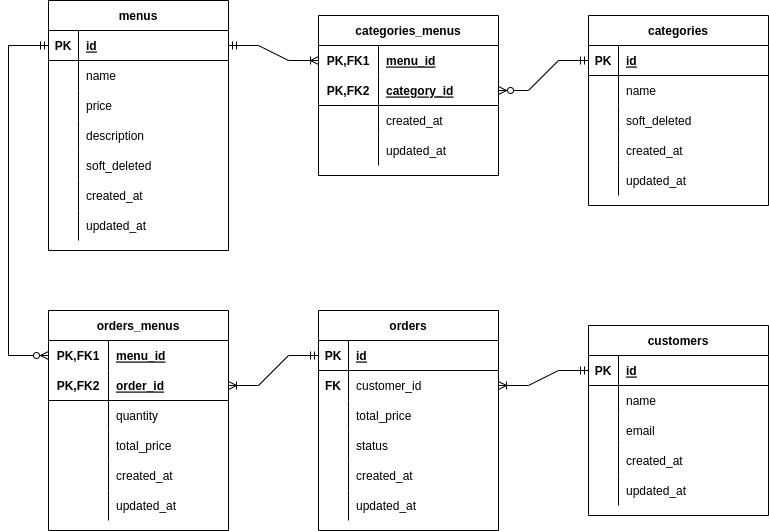

# Gigih Catering Family - Yohan Ardiansyah (KM_G2BE2114)

A project with Ruby on Rails framework and using REST API for its data communication. For the project detail itself, the project focused to solve Gigih Catering Family business problem to monitor their business. This project originally used for finishing final project from Generasi Gigih Yayasan Anak Bangsa Bisa. 

## Visuals

### Database Design

### REST API

### UI API consumer

## Installation

### Requirement

- Ruby 3.0.3
- Gem
- Bundler

### Installation Process

- Go to the Project's directory
- Run command `bundle install` to install the dependencies
- Run command `rails db:migrate` to setup the database
- Run command `bundle exec whenever --update-crontab --set environment=development` to setup the task scheduler
- Run command `rails server` to start the server

## Usage

### JSON Object
For the API, we will use some Object that can be a JSON response for the REST API.

<table>
  <thead>
    <tr>
      <th>
        Name
      </th>
      <th>
        JSON Object
      </th>
    </tr>
  </thead>
  <tbody>
    <tr>
      <td>
        <strong>Category Object</strong>
      </td>
      <td>
        <pre>
  {
    id(integer),
    name(string),
    created_at(string),
    updated_at(string),
    soft_deleted(boolean)
  }
        </pre>
        Example:
        <pre>
  {
    "id": 1,
    "name": "Beverages",
    "created_at": "2022-04-19T02:52:49.072Z",
    "updated_at": "2022-04-19T02:52:49.072Z",
    "soft_deleted": false
  }
        </pre>
      </td>
    </tr>
    <tr>
      <td>
        <strong>Menu Object</strong>
      </td>
      <td>
        <pre>
  {
    id(integer),
    name(string),
    price(float),
    description(string),
    created_at(string),
    updated_at(string),
    soft_deleted(boolean)
  }
        </pre>
        Example:
        <pre>
  {
    "id": 1,
    "name": "Nasi Uduk",
    "price": 1200.5,
    "description": "Nasi yang sangat enak",
    "created_at": "2022-04-19T02:52:49.072Z",
    "updated_at": "2022-04-19T02:52:49.072Z",
    "soft_deleted": false
  }
        </pre>
      </td>
    </tr>
    <tr>
      <td>
        <strong>
          Customer Object         
        </strong>
      </td>
      <td>
        <pre>
{
  id(integer),
  name(string),
  email(string),
  created_at(string),
  updated_at(string)
}
        </pre>
        Example:
        <pre>
{
  "id": 1,
  "name": "Bob",
  "email": "bob@mail.com",
  "created_at": "2023-04-19T02:52:49.072Z",
  "updated_at": "2022-04-19T02:52:49.072Z"
}
        </pre>
      </td>
    </tr>
    <tr>
      <td>
        <strong>
          Order Object
        </strong>
      </td>
      <td>
        <pre>
{
  id(integer),
  total_price(float),
  status(string),
  created_at(string),
  updated_at(string),
  order_menus(array of OrderMenu Object),
  customer(Customer Object)
}
        </pre>
        Example:
        <pre>
{
  "id": 1,
  "total_price": 35000.75,
  "status": "NEW",
  "created_at": "2023-04-19T02:52:49.072Z",
  "updated_at": "2022-04-19T02:52:49.072Z",
  "order_menus": [OrderMenu Object],
  "customer": Customer Object
}
        </pre>
      </td>
    </tr>
    <tr>
      <td>
        <strong>
          OrderMenu Object
        </strong>
      </td>
      <td>
        <pre>
{
  id(integer),
  quantity(integer),
  total_price(float),
  created_at(string),
  updated_at(string),
  menu(Menu Object),
  order(Order Object)
}
        </pre>
        Example:
        <pre>
{
  "id": 1,
  "quantity": 5,
  "total_price": 2000.75,
  "created_at":a "2023-04-19T02:52:49.072Z",
  "updated_at": "2022-04-19T02:52:49.072Z",
  "menu": Menu Object,
  "order": Order Object
}
        </pre>
      </td>
    </tr>
  </tbody>
</table>

### User Story & API Contract

<table>
  <thead>
    <td>
      #  
    </td>
    <td>
      Usage
    </td>
    <td>
      Detail
    </td>
  </thead>
  <tbody>
    <tr>
      <td>
        Extra from Myself (Responses)      
      </td>
      <td>
        Response from API
      </td>
      <td>
        If I'm not specify the response in the next API contract, then the response will almost the same as this.  
        Response:
        <pre>
{
  message(string)
}
        </pre>
        Example:
        <pre>
{
  "message": "Category updated"
}
        </pre>
        The error response's format will be the same too, although the status code of the response will be different
      </td>
    </tr>
    <tr>
      <td>
        Extra from Myself (Categories)      
      </td>
      <td>
        Create, Read, Edit, and Delete Categories
      </td>
      <td>
        Because the menu item needs category, I will tell the categories usage first.  
        <strong>
          <code>POST /api/categories</code>&ensp;: Create a category
        </strong> 
        Payload: 
        <pre>
{
  category:
  {
    name(string)
  }
}
        </pre>
        Example: 
        <pre>
{
  "category":
  {
    "name": "Beverages"
  }
}
        </pre>
        Response: 
        <code>Category Object</code>  
        <strong>
          <code>PUT /api/categories/:category_id</code>&ensp;: Edit a category
        </strong> 
        Payload:
        <pre>
{
  name(string)
}
        </pre>
        Example:
        <pre>
{
  "name": "Beverages"
}
        </pre>
        <strong>
          <code>GET /api/categories&ensp;</code>: Get array of categories
        </strong> 
        Response: 
        <code>Array of Category Object</code>  
        Assumptions: Because if we delete the category data directly, it can be affect the menu data directly so I use a soft delete technique to approach this  
        <strong>
          <code>DELETE /api/categories/:category_id</code>&ensp;: Soft delete a category
        </strong>  
        You can consume these APIs with UI at URI <code>/categories</code> from the browser
      </td>
    </tr>
    <tr>
      <td>
        1      
      </td>
      <td>
        As an owner,  I want to create a new menu item, So that I can show them to my customers later.
      </td>
      <td>
        <strong>
          <code>POST /api/menus</code> &ensp;: Create a menu
        </strong> 
        Payload: 
        <pre>
{
  menu:
  {
    name(string),
    description(string),
    price(float),
    categories(Array of Category Id),
  }
}
        </pre>
        Example: 
        <pre>
{
  "menu": 
  {
    "name": "Nasi Uduk",
    "description": "Nasi yang mantab",
    "price": 10000.5,
    "categories": [1, 2],
  }
}
        </pre>
        Response: 
        <code>Menu Object</code>  
        You can consume this API with UI at URI <code>/menus/owner</code> from the browser
      </td>
    </tr>
    <tr>
      <td>
        2
      </td>
      <td>
        As an owner, I want to update an existing menu item  So that I can modify info related to the menu item
      </td>
      <td>
        <strong>
          <code>PUT /api/menus/:menu_id</code> &ensp;: Edit a menu
        </strong> 
        Payload: 
        <pre>
{
  name(string),
  description(string),
  price(float),
  categories(Array of Category Id),
}
        </pre>
        Example: <pre>
{
  "name": "Nasi Kucing",
  "description": "Nasi seukuran kucing",
  "price": 10000.5,
  "categories": [2, 4]
}
        </pre>
        You can consume this API with UI at URI <code>/menus/owner</code> from the browser
      </td>
    </tr>
    <tr>
      <td>
        3
      </td>
      <td>
        As an owner,  I want to show the list of all menu items  So that my customers can see the list of all menu items that I sell
      </td>
      <td>
        <strong>
          <code>GET /api/menus</code>&ensp;: Get array of menus for Customer
        </strong> 
        Response: 
        <code>Array of Menu Object</code>  
        Query that can be used: 
        - <code>category_id(int)</code>: To get the menu according to its category  
        You can consume this API with UI at URI <code>/menus</code> from the browser
      </td>
    </tr>
    <tr>
      <td>
        4
      </td>
      <td>
        As an owner,  I want to delete an existing menu item  So that I can remove a menu item that is no longer provided by my catering service
      </td>
      <td>
        Assumptions: Because if we delete the menu data directly, it can be affect the order data directly and make the algorithm to delete more complex, so I use a soft delete technique to approach this  
        <strong>
          <code>DELETE /api/menus/:menu_id</code>&ensp;: Soft delete a menu
        </strong>  
        You can consume this API with UI at URI <code>/menus/owner</code> from the browser
      </td>
    </tr>
    <tr>
      <td>
        5
      </td>
      <td>
        As an owner,  I want to add customer’s order  So that I can prepare their order
      </td>
      <td>
        <strong>
          <code>POST /api/orders</code> &ensp;: Create a order
        </strong> 
        Payload: 
        <pre>
{
  customer:
  {
    name(string),
    email(string)
  },
  menu_ids(Array of Menu Id),
  menu_quantities(Array of Quantity for each menu (Ordered by the menu Id)),
}
        </pre>
        Example: 
        <pre>
{
  "customer":
  {
    "name": "Bob",
    "email": "bob@gmail.com"
  },
  "menu_ids": [1, 2],
  "menu_quantities": [2, 3]
}
        </pre>
        You can consume this API with UI at URI <code>/orders</code> from the browser
      </td>
    </tr>
    <tr>
      <td>
        6
      </td>
      <td>
        As an owner,  I want to update a customer’s order  So that I can modify info related to the order   
      </td>
      <td>
        Assumptions: From the user story description for this point, I assume that the owner just need to update the order status and can't edit the other attributes.  
        <strong>
          <code>PUT /api/orders/:order_id</code> &ensp;: Edit a order
        </strong> 
        Payload: 
        <pre>
{
  status(string between("NEW", "PAID", "CANCELED"))
}
        </pre>
        Example: 
        <pre>
{
  "status": "NEW"
}
        </pre>
        You can consume this API with UI at URI <code>/orders</code> from the browser  
        For the status update automation from "NEW" INTO "CANCELED" at 5 P.M should be already run with command <code>bundle exec whenever --update-crontab --set environment=development</code>
      </td>
    </tr>
    <tr>
      <td>
        7
      </td>
      <td>
        As an owner,  I want to see a daily report of orders,  So that I can see the revenue that I have generated for that day
      </td>
      <td>
        <strong>
          <code>GET /api/orders/revenue</code>&ensp;: Get array of orders that get revenue
        </strong> 
        Response: <code>Array of Order Object</code>  
        Query that can be used: 
        - <code>email(string)</code>: Email of the customer 
        - <code>max_price(float)</code>: Maximum total price of an order 
        - <code>min_price(float)</code>: Minimum total price of an order 
        - <code>max_date(date with format yyyy-mm-dd)</code>: Maximum range of date 
        - <code>min_date(date with format yyyy-mm-dd)</code>: Minimum range of date  
        You can consume this API with UI at URI <code>/orders/revenue</code> from the browser
      </td>
    </tr>
    <tr>
      <td>
        Extra from Myself (GET all order)
      </td>
      <td>
        Get all order at the system
      </td>
      <td>
        <strong>
          <code>GET /api/orders</code>&ensp;: Get array of orders
        </strong> 
        Response: <code>Array of Order Object</code>  
        You can consume this API with UI at URI <code>/orders</code> from the browser
      </td>
    </tr>
  </tbody>
</table>

## Rails on Replit

This is a template to get you started with Rails on Replit. It's ready to go so you can just hit run and start coding!

This template was generated using `rails new` (after you install the `rails` gem from the packager sidebar) so you can always do that if you prefer to set it up from scratch. The only had two make config changes we had to make to run it on Replit:

- bind the app on `0.0.0.0` instead of `localhost` (see `.replit`)
- allow `*.repl.co` hosts (see `config/environments/development.rb`)
- allow the app to be iframed on `replit.com` (see `config/application.rb`)

### Running the app

Simple hit run! You can edit the run command from the `.replit` file.

### Running commands

Start every command with `bundle exec` so that it runs in the context of the installed gems environment. The console pane will give you output from the server but you can run arbitrary command from the shell without stopping the server.

### Database

SQLite would work in development but we don't recommend running it in production. Instead look into using the built-in [Replit database](http://docs.replit.com/misc/database). Otherwise you are welcome to connect databases from your favorite provider. 

### Help

If you need help you might be able to find an answer on our [docs](https://docs.replit.com) page. Alternatively you can [ask in the community](https://replit.com/talk/ask). Feel free to report bugs [here](https://replit.com/bugs) and give us feedback [here](https://Replit/feedback).